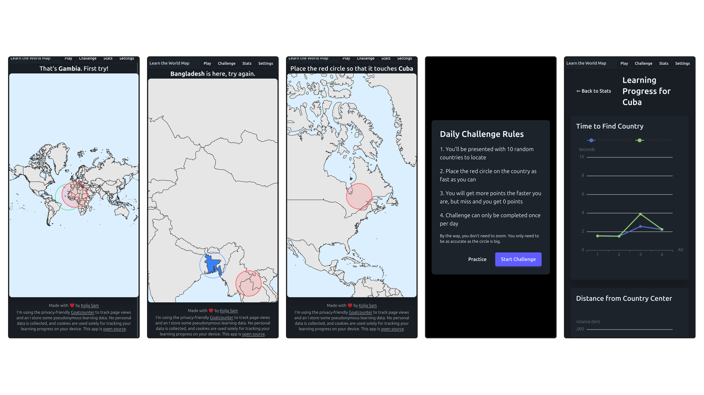

# Learn the Worldmap


_do you know where the countries are?_

**[Play the free online practice game](https://map.koljapluemer.com)**

[](https://ko-fi.com/S6S81CWUVD)

## Features

1. Spaced-Repetition based selection of which country should be learned
2. As the learner gets better, they have to find a given country with more precision
3. Detailed statistics about how learning a country is going
4. *WIP:* Daily Challenge Mode
5. *Planned:* Custom Playlist Mode to practice exactly what you want to practice





## Development

First of all: Feedback is welcome, bug reports are welcome, contributions are welcome. If anything's unclear, head over to issues and write what's on your mind.

### Running It

1. Clone the repository
2. Make sure you have `npm` installed
3. Run `npm i`
4. Run `npm run dev` and open the displayed link in your browser

### Folder Structure

This project follows a module-based approach, similar to the one explained in [this video](https://www.youtube.com/watch?v=iuyzO2QkY7A).

You will not find folders such as `composables/` or `components/` here, as is custom in many vue projects.
Instead, code is separated across features, with the intent that changes to feature X or use case Y can be done in the 
folder dedicated for it, instead of all across the codebase.

You can find per-folder documentation for important directories in the `.doc.md` of the given folder. Alternatively, use the list below to directly jump to the relevant documentation:


- [map-data](src/modules/map-data/.doc.md) 
- [play](src/modules/play/.doc.md)
- [misc-views](src/modules/.doc.md)


### Testing

For now, there are some E2E tests, which were recorded with Playwright.
You'll find them in the `tests/` directory.

To run them, execute the app with the test env var set, by running:

```
npm run testdev
```

Leave this running, and in another terminal, run the tests:

```
npm run test:e2e
```